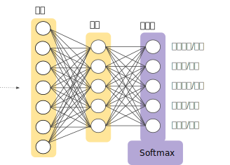

# 多类别神经网络 (Multi-Class Neural Networks)：Softmax

我们已经知道，[逻辑回归](https://developers.google.com/machine-learning/crash-course/logistic-regression)可生成介于 0 和 1.0 之间的小数。例如，某电子邮件分类器的逻辑回归输出值为 0.8，表明电子邮件是垃圾邮件的概率为 80%，不是垃圾邮件的概率为 20%。很明显，一封电子邮件是垃圾邮件或非垃圾邮件的概率之和为 1.0。

**Softmax** 将这一想法延伸到多类别领域。也就是说，在多类别问题中，Softmax 会为每个类别分配一个用小数表示的概率。这些用小数表示的概率相加之和必须是 1.0。与其他方式相比，这种附加限制有助于让训练过程更快速地收敛。

例如，回到我们在图 1 中看到的图片分析示例，Softmax 可能会得出图片属于某一特定类别的以下概率：

| 类别 | 概率  |
| ---- | ----- |
| 苹果 | 0.001 |
| 熊   | 0.04  |
| 糖果 | 0.008 |
| 狗狗 | 0.95  |
| 鸡蛋 | 0.001 |

Softmax 层是紧挨着输出层之前的神经网络层。Softmax 层必须和输出层拥有一样的节点数。

**图 2. 神经网络中的 Softmax 层。**

## Softmax 选项

请查看以下 Softmax 变体：

- **完整 Softmax** 是我们一直以来讨论的 Softmax；也就是说，Softmax 针对每个可能的类别计算概率。
- **候选采样**指 Softmax 针对所有正类别标签计算概率，但仅针对负类别标签的随机样本计算概率。例如，如果我们想要确定某个输入图片是小猎犬还是寻血猎犬图片，则不必针对每个非狗狗样本提供概率。

类别数量较少时，完整 Softmax 代价很小，但随着类别数量的增加，它的代价会变得极其高昂。候选采样可以提高处理具有大量类别的问题的效率。

## 一个标签与多个标签

Softmax 假设每个样本只是一个类别的成员。但是，一些样本可以同时是多个类别的成员。对于此类示例：

- 您不能使用 Softmax。
- 您必须依赖多个逻辑回归。

例如，假设您的样本是只包含一项内容（一块水果）的图片。Softmax 可以确定该内容是梨、橙子、苹果等的概率。如果您的样本是包含各种各样内容（几碗不同种类的水果）的图片，您必须改用多个逻辑回归。
