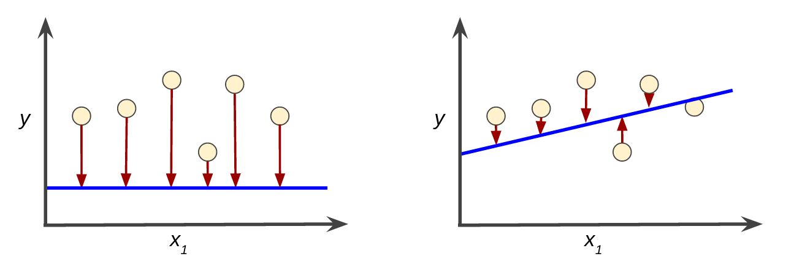
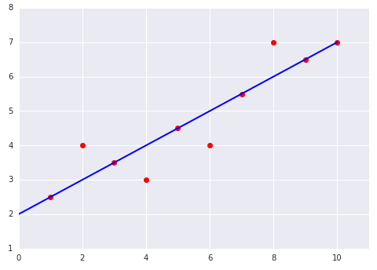

# 训练与损失

简单来说，**训练**模型表示通过有标签样本来学习（确定）所有权重和偏差的理想值。在监督式学习中，机器学习算法通过以下方式构建模型：检查多个样本并尝试找出可最大限度地减少损失的模型；这一过程称为**经验风险最小化**。

损失是对糟糕预测的惩罚。也就是说，**损失**是一个数值，表示对于单个样本而言模型预测的准确程度。如果模型的预测完全准确，则损失为零，否则损失会较大。训练模型的目标是从所有样本中找到一组平均损失“较小”的权重和偏差。例如，图 3 左侧显示的是损失较大的模型，右侧显示的是损失较小的模型。关于此图，请注意以下几点：

- 红色箭头表示损失。
- 蓝线表示预测。



<center> 图 3. 左侧模型的损失较大；右侧模型的损失较小。 </center>

请注意，左侧曲线图中的红色箭头比右侧曲线图中的对应红色箭头长得多。显然，相较于左侧曲线图中的蓝线，右侧曲线图中的蓝线代表的是预测效果更好的模型。

您可能想知道自己能否创建一个数学函数（损失函数），以有意义的方式汇总各个损失。

### 平方损失：一种常见的损失函数

接下来我们要看的线性回归模型使用的是一种称为**平方损失**（又称为 **L2 损失**）的损失函数。单个样本的平方损失如下：

```
  = the square of the difference between the label and the prediction
  = (observation - prediction(x))2
  = (y - y')2
```


**均方误差** (**MSE**) 指的是每个样本的平均平方损失。要计算 MSE，请求出各个样本的所有平方损失之和，然后除以样本数量：

<math xmlns="http://www.w3.org/1998/Math/MathML" display="block">
  <mi>M</mi>
  <mi>S</mi>
  <mi>E</mi>
  <mo>=</mo>
  <mfrac>
​    <mn>1</mn>
​    <mi>N</mi>
  </mfrac>
  <munder>
​    <mo>&#x2211;<!-- ∑ --></mo>
​    <mrow class="MJX-TeXAtom-ORD">
​      <mo stretchy="false">(</mo>
​      <mi>x</mi>
​      <mo>,</mo>
​      <mi>y</mi>
​      <mo stretchy="false">)</mo>
​      <mo>&#x2208;<!-- ∈ --></mo>
​      <mi>D</mi>
​    </mrow>
  </munder>
  <mo stretchy="false">(</mo>
  <mi>y</mi>
  <mo>&#x2212;<!-- − --></mo>
  <mi>p</mi>
  <mi>r</mi>
  <mi>e</mi>
  <mi>d</mi>
  <mi>i</mi>
  <mi>c</mi>
  <mi>t</mi>
  <mi>i</mi>
  <mi>o</mi>
  <mi>n</mi>
  <mo stretchy="false">(</mo>
  <mi>x</mi>
  <mo stretchy="false">)</mo>
  <msup>
​    <mo stretchy="false">)</mo>
​    <mn>2</mn>
  </msup>
</math>


其中：

- `(x,y)`指的是样本，其中
  - `x `指的是模型进行预测时使用的特征集（例如，温度、年龄和交配成功率）。
  - `y` 指的是样本的标签（例如，每分钟的鸣叫次数）。
- `prediction(x)` 指的是权重和偏差与特征集 `x` 结合的函数。
- `D` 指的是包含多个有标签样本（即` (x,y)`）的数据集。
- `N `指的是 `D` 中的样本数量。

虽然 MSE 常用于机器学习，但它既不是唯一实用的损失函数，也不是适用于所有情形的最佳损失函数。


## 均方误差练习

请看以下两个曲线图：




对于以上曲线图中显示的两个数据集，哪个数据集的均方误差 (MSE) **较高**？


