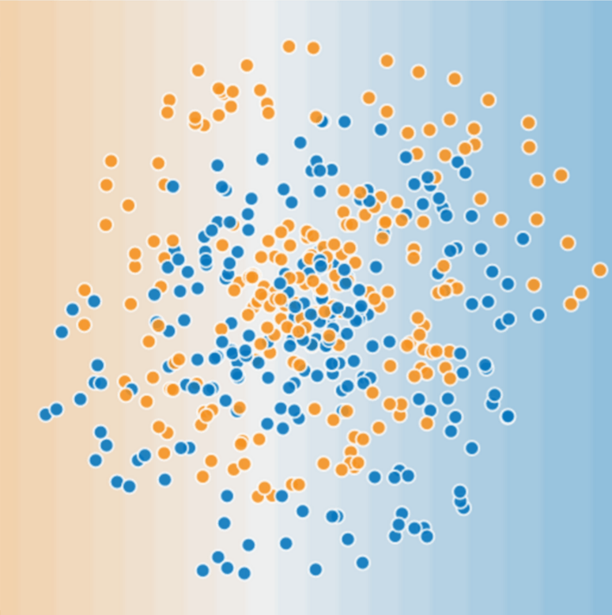
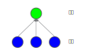
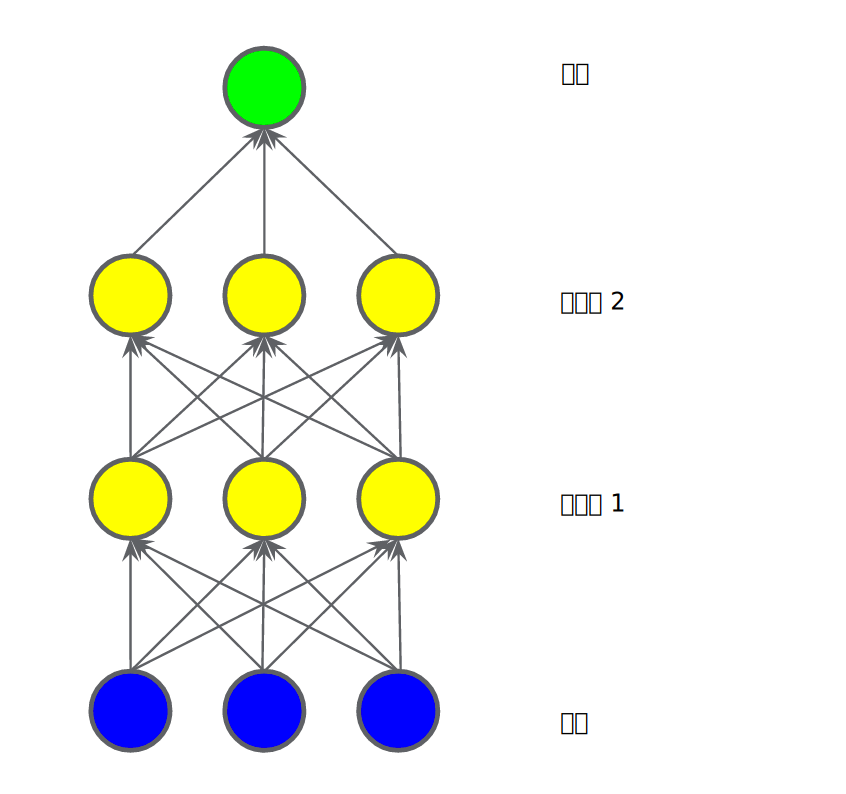
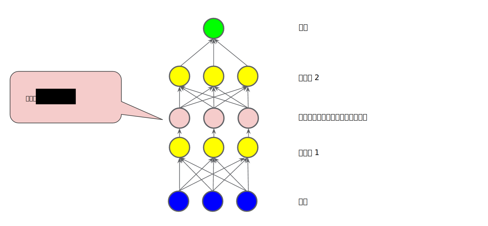
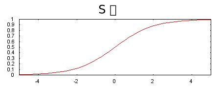
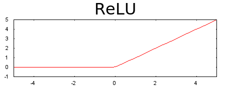

# 神经网络简介 (Introduction to Neural Networks)：剖析

如果您还记得[特征组合](https://developers.google.com/machine-learning/crash-course/feature-crosses/video-lecture)这一单元的话，就会发现以下分类问题属于非线性问题：

**图 1. 非线性分类问题。**

“非线性”意味着您无法使用形式为

b+w1x1+w2x2

的模型准确预测标签。也就是说，“决策面”不是直线。之前，我们了解了对非线性问题进行建模的一种可行方法 -特征组合。]

现在，请考虑以下数据集：

**图 2. 更难的非线性分类问题。**

图 2 所示的数据集问题无法用线性模型解决。

为了了解神经网络可以如何帮助解决非线性问题，我们首先用图表呈现一个线性模型：

**图 3. 用图表呈现的线性模型。**

每个蓝色圆圈均表示一个输入特征，绿色圆圈表示各个输入的加权和。

要提高此模型处理非线性问题的能力，我们可以如何更改它？

## 隐藏层

在下图所示的模型中，我们添加了一个表示中间值的“隐藏层”。隐藏层中的每个黄色节点均是蓝色输入节点值的加权和。输出是黄色节点的加权和。

**图 4. 两层模型的图表。**

此模型是线性的吗？是的，其输出仍是其输入的线性组合。

在下图所示的模型中，我们又添加了一个表示加权和的“隐藏层”。

**图 5. 三层模型的图表。**

此模型仍是线性的吗？是的，没错。当您将输出表示为输入的函数并进行简化时，您只是获得输入的另一个加权和而已。该加权和无法对图 2 中的非线性问题进行有效建模。

## 激活函数

要对非线性问题进行建模，我们可以直接引入非线性函数。我们可以用非线性函数将每个隐藏层节点像管道一样连接起来。

在下图所示的模型中，在隐藏层 1 中的各个节点的值传递到下一层进行加权求和之前，我们采用一个非线性函数对其进行了转换。这种非线性函数称为激活函数。

**图 6. 包含激活函数的三层模型的图表。**

现在，我们已经添加了激活函数，如果添加层，将会产生更多影响。通过在非线性上堆叠非线性，我们能够对输入和预测输出之间极其复杂的关系进行建模。简而言之，每一层均可通过原始输入有效学习更复杂、更高级别的函数。如果您想更直观地了解这一过程的工作原理，请参阅 [Chris Olah 的精彩博文](http://colah.github.io/posts/2014-03-NN-Manifolds-Topology/)。

### 常见激活函数

以下 **S 型**激活函数将加权和转换为介于 0 和 1 之间的值。

<math xmlns="http://www.w3.org/1998/Math/MathML" display="block">
  <mi>F</mi>
  <mo stretchy="false">(</mo>
  <mi>x</mi>
  <mo stretchy="false">)</mo>
  <mo>=</mo>
  <mfrac>
​    <mn>1</mn>
​    <mrow>
​      <mn>1</mn>
​      <mo>+</mo>
​      <msup>
​        <mi>e</mi>
​        <mrow class="MJX-TeXAtom-ORD">
​          <mo>&#x2212;<!-- − --></mo>
​          <mi>x</mi>
​        </mrow>
​      </msup>
​    </mrow>
  </mfrac>
</math>

曲线图如下：

**图 7. S 型激活函数。**

相较于 S 型函数等平滑函数，以下**修正线性单元**激活函数（简称为 **ReLU**）的效果通常要好一点，同时还非常易于计算。

`F(x)=max(0,x)`

ReLU 的优势在于它基于实证发现（可能由 ReLU 驱动），拥有更实用的响应范围。S 型函数的响应性在两端相对较快地减少。

**图 8. ReLU 激活函数。**

实际上，所有数学函数均可作为激活函数。假设 σ 表示我们的激活函数（ReLU、S 型函数等等）。因此，网络中节点的值由以下公式指定：

`σ(w⋅x+b)`

TensorFlow 为[各种激活函数](https://www.tensorflow.org/api_docs/python/nn.html)提供开箱即用型支持。但是，我们仍建议从 ReLU 着手。

## 总结

现在，我们的模型拥有了人们通常所说的“神经网络”的所有标准组件：

- 一组节点，类似于神经元，位于层中。
- 一组权重，表示每个神经网络层与其下方的层之间的关系。下方的层可能是另一个神经网络层，也可能是其他类型的层。
- 一组偏差，每个节点一个偏差。
- 一个激活函数，对层中每个节点的输出进行转换。不同的层可能拥有不同的激活函数。
