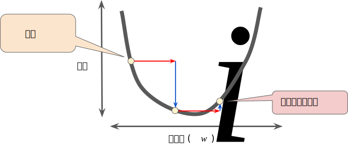
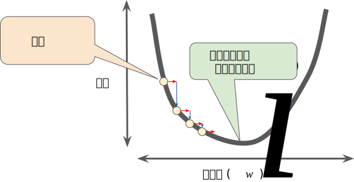

# 学习速率

正如之前所述，梯度矢量具有方向和大小。梯度下降法算法用梯度乘以一个称为**学习速率**（有时也称为**步长**）的标量，以确定下一个点的位置。例如，如果梯度大小为 2.5，学习速率为 0.01，则梯度下降法算法会选择距离前一个点 0.025 的位置作为下一个点。

**超参数**是编程人员在机器学习算法中用于调整的旋钮。大多数机器学习编程人员会花费相当多的时间来调整学习速率。如果您选择的学习速率过小，就会花费太长的学习时间：

**图 6. 学习速率过小。**

相反，如果您指定的学习速率过大，下一个点将永远在 U 形曲线的底部随意弹跳，就好像量子力学实验出现了严重错误一样：

**图 7. 学习速率过大。**

每个回归问题都存在一个金发姑娘学习速率。“金发姑娘”值与损失函数的平坦程度相关。如果您知道损失函数的梯度较小，则可以放心地试着采用更大的学习速率，以补偿较小的梯度并获得更大的步长。

**图 8. 学习速率恰恰好。**

