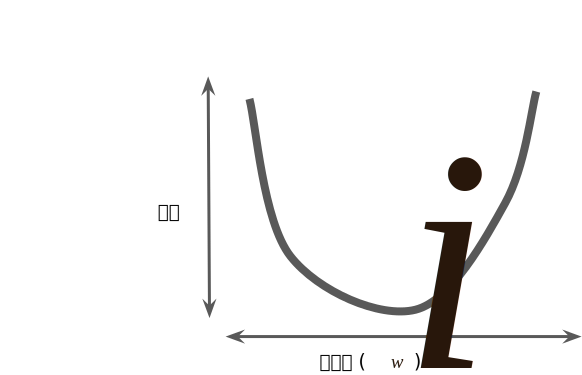
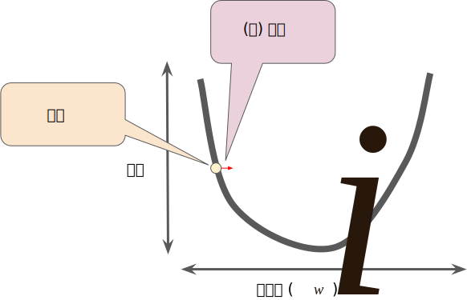
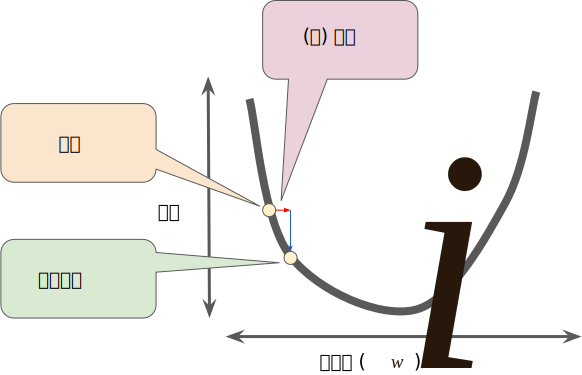

# 梯度下降法

迭代方法图（图 1）包含一个标题为“计算参数更新”的华而不实的绿框。现在，我们将用更实质的方法代替这种华而不实的算法。

假设我们有时间和计算资源来计算 w1 的所有可能值的损失。对于我们一直在研究的回归问题，所产生的损失与 w1 的图形始终是凸形。换言之，图形始终是碗状图，如下所示：

图 2. 回归问题产生的损失与权重图为凸形。

凸形问题只有一个最低点；即只存在一个斜率正好为 0 的位置。这个最小值就是损失函数收敛之处。

通过计算整个数据集中 w1 每个可能值的损失函数来找到收敛点这种方法效率太低。我们来研究一种更好的机制，这种机制在机器学习领域非常热门，称为**梯度下降法**。

梯度下降法的第一个阶段是为 w1 选择一个起始值（起点）。起点并不重要；因此很多算法就直接将 w1 设为 0 或随机选择一个值。下图显示的是我们选择了一个稍大于 0 的起点：

图 3. 梯度下降法的起点

然后，梯度下降法算法会计算损失曲线在起点处的梯度。简而言之，**梯度**是偏导数的矢量；它可以让您了解哪个方向距离目标“更近”或“更远”。请注意，损失相对于单个权重的梯度（如图 3 所示）就等于导数。

请注意，梯度是一个矢量，因此具有以下两个特征：

- 方向
- 大小

梯度始终指向损失函数中增长最为迅猛的方向。梯度下降法算法会沿着负梯度的方向走一步，以便尽快降低损失。

**图 4. 梯度下降法依赖于负梯度。**

为了确定损失函数曲线上的下一个点，梯度下降法算法会将梯度大小的一部分与起点相加，如下图所示：

**图 5. 一个梯度步长将我们移动到损失曲线上的下一个点。**

然后，梯度下降法会重复此过程，逐渐接近最低点。ß
